# 项目架构说明

## 项目背景

该平台面向应急物流、供应商限量物资发布和自然灾害应急采购场景。自然灾害发生后，采购方需要快速抢购发电机、净水设备、照明设备等紧缺物资，供应商需要维护可供物资和资质能力，司机需要在待分配运输订单池中抢接运输任务并完成配送。平台吸收 Fleetbase 的订单运营思路，将 Order、Driver、Place、Tracking、Dispatch 作为主线，通过缓存、消息队列、分布式锁和 Redis 多种数据结构，解决采购方高并发抢购、司机高并发抢单、订单追踪、履约评价和应急调度问题。

## 总体架构

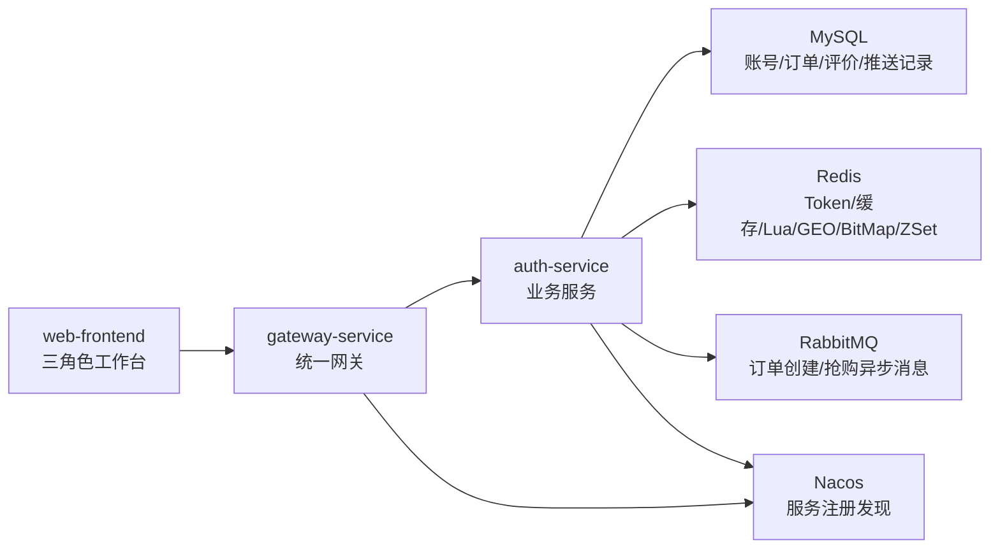

## 模块职责

### gateway-service

- 统一接收前端请求。
- 对非登录接口校验 `Authorization: Bearer token`。
- 从 Redis 读取登录态。
- 向下游透传：
  - `X-User-Id`
  - `X-User-Type`
  - `X-Username`
  - `X-Display-Name`

### auth-service

- 登录和 Redis Token 管理。
- 供应商目录和供应物资管理。
- 供应商店铺详情、采购清单批量提交、角色通知中心。
- 采购订单创建、供应商确认/拒单、库存扣减、订单时间线。
- 高并发采购方抢购限量应急物资。
- 司机待分配订单池、订单推送和高并发运力抢单。
- 运输订单发货地/目的地经纬度、司机到达节点上报、智能调度推荐和追踪聚合。
- 三方履约评价。
- Redis GEO、BitMap、ZSet 扩展能力。
- RabbitMQ 消费、死信队列统计和补偿接口。

### web-frontend

- 采购方页面：供应商大厅、搜索筛选、店铺详情、采购清单、通知中心、采购订单、运输追踪。
- 供应商页面：供货工作台、供应物资管理、供货订单、资质展示、运输追踪。
- 司机页面：运输大厅、推送订单、通知中心、出勤状态、关注采购方、到达节点上报、运输追踪。

## 核心流程

### 登录流程

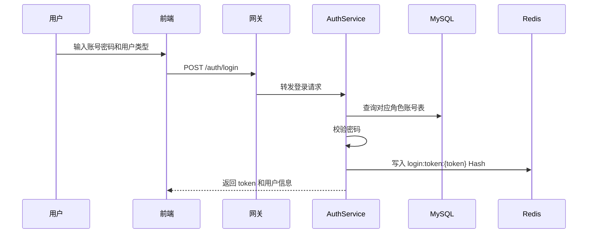

面试讲法：

> 登录没有使用 JWT，而是使用 Redis 存储 Token 登录态。这样服务端可以主动踢出、续期、支持多端登录，也更适合分布式网关统一鉴权。网关校验通过后，把用户 ID 和角色透传给业务服务。

### 供应商目录 Cache Aside

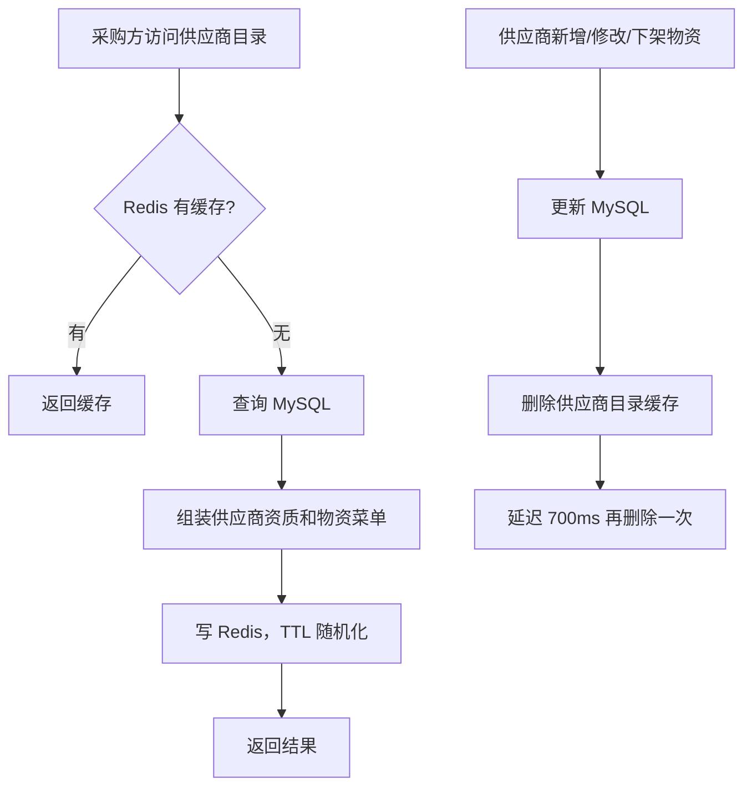

面试讲法：

> 供应商目录属于读多写少场景，所以用了 Cache Aside。读请求先查 Redis，缓存未命中再查 MySQL 并回填缓存；供应商修改物资后删除缓存，并通过延迟双删降低并发读写下旧缓存回写的概率。

### 采购下单、地点建模与订单推送

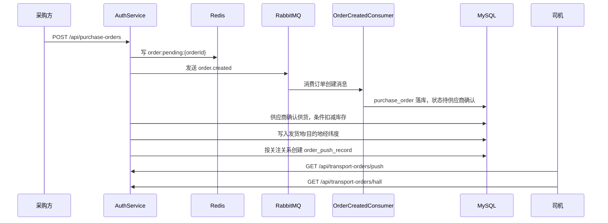

面试讲法：

> 订单创建先写 Redis 临时订单，再发 RabbitMQ，消费者异步落库。订单会记录发货地和目的地，发货地默认取供应商地址与经纬度，目的地默认取采购方或 RFQ 配送地址与经纬度。供应商确认供货时用 MySQL 条件更新扣减库存，订单进入待分配运输订单池并按关注关系创建推送记录。司机侧既可以查看关注关系推送过来的订单，也可以主动从订单大厅拉取，这就是推拉结合。

### 订单状态流转与时间线

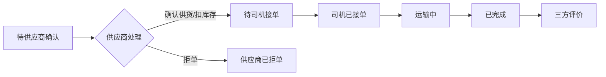

面试讲法：

> 订单状态不是简单字段展示，而是由服务端状态机推进。供应商确认时通过条件更新扣减库存，司机只能接待司机接单状态的订单，接单后继续推进运输中和已完成。每一次状态变化都会写入 `order_timeline`，前端可以展示完整操作轨迹，便于追踪和排查。

### 运输追踪与司机位置上报

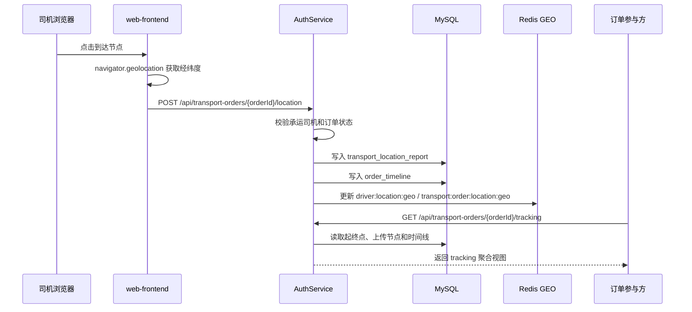

面试讲法：

> 运输追踪不是从时间线备注里硬解析坐标，而是单独建了 `transport_location_report` 保存司机上传节点。司机点击“到达节点”后，浏览器定位拿到经纬度，后端校验司机确实承运该订单，并且订单处于可上报阶段。MySQL 保存完整历史，Redis GEO 只保存司机和订单最新位置，用于后续扩展附近查询或实时看板。前端展示的是路线节点、司机上传节点和时间线，没有伪装成地图导航。

### 采购版美团工作台

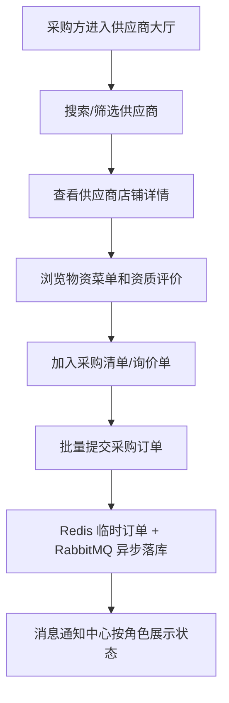

面试讲法：

> 我把采购方页面做成类似美团商家页的体验，但业务语义是企业采购。供应商相当于店铺，物资相当于菜单，采购方可以搜索筛选、查看资质评价、把多个物资加入采购清单，再批量生成采购订单。提交后仍复用 Redis + MQ 的异步下单链路，保证前端体验和后端架构是一致的。

### 高并发采购方抢购

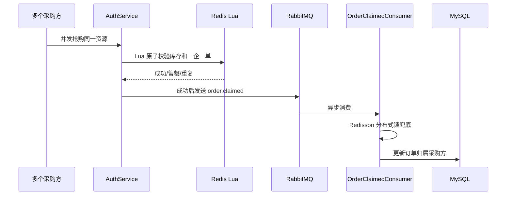

面试讲法：

> 抢购核心不能直接打 MySQL，所以先用 Redis Lua 做原子扣减和一企一单校验，成功后发 MQ 异步落库。消费者侧再用 Redisson 锁兜底，避免重复落库和并发覆盖。

### 高并发司机抢运输单

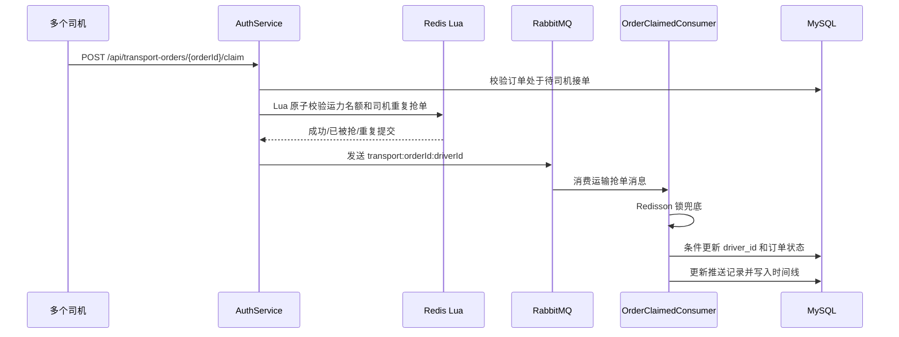

面试讲法：

> 司机抢运输单不能让所有请求直接竞争 MySQL，所以先用 Redis Lua 对订单运力名额做原子预占，并记录司机是否重复提交。预占成功后发送 RabbitMQ，消费者使用 Redisson 锁兜底，并通过 MySQL 条件更新把订单从“待司机接单”推进到“司机已接单”。如果消息重复消费或订单已被其他司机绑定，条件更新会失败并直接返回，保证幂等。

### 三方履约评价

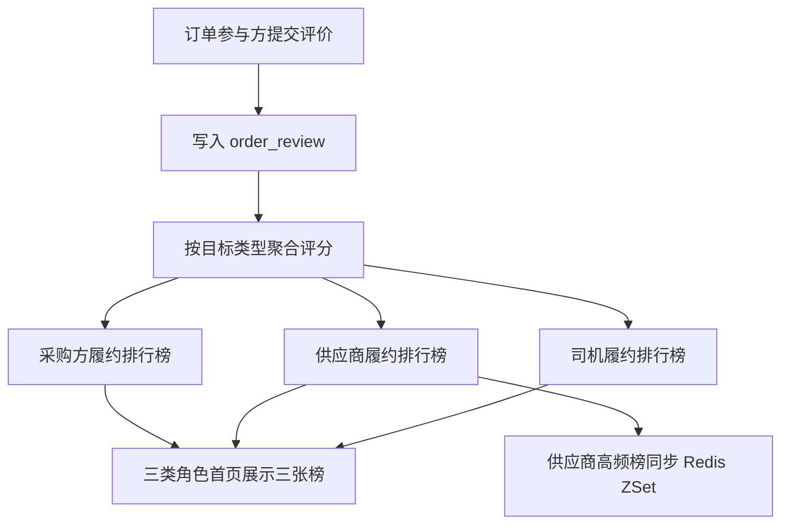

面试讲法：

> 平台围绕订单做三方评价。采购方、供应商、司机都可以作为评价目标沉淀履约分，三类角色登录后都能看到采购方榜、供应商榜和司机榜。供应商榜仍同步 Redis ZSet，适合高频展示。

### Redis 数据结构扩展

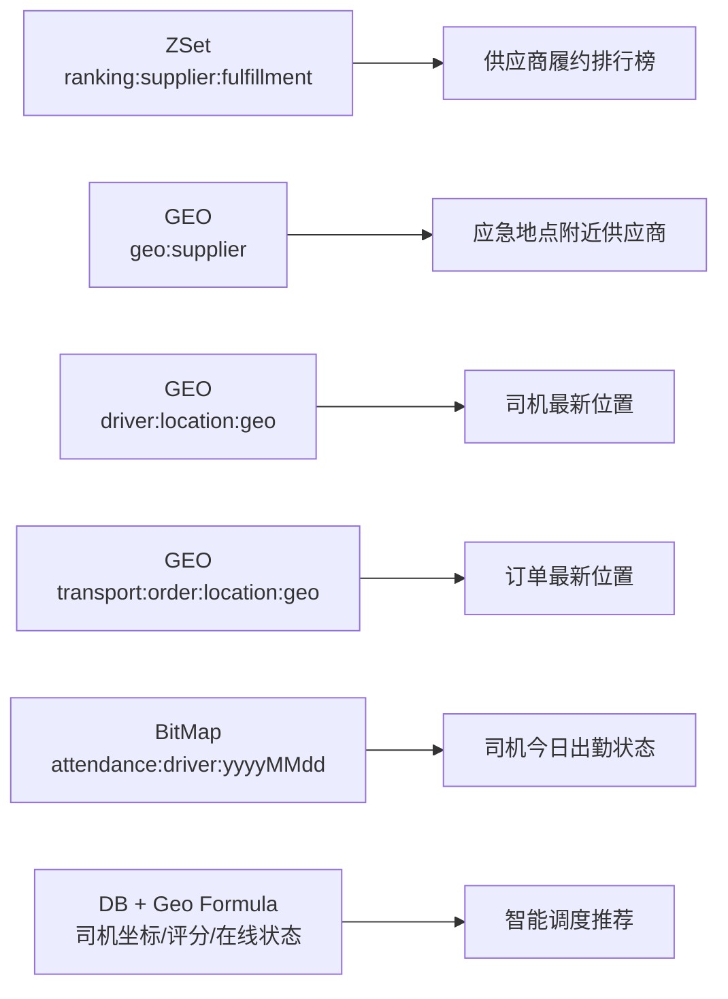

面试讲法：

> Redis 不只是缓存。ZSet 用于高频供应商排行榜，GEO 用于附近供应商调度，也用于保存司机和订单最新位置，BitMap 用于海量司机签到状态。待司机接单订单会结合司机在线状态、距发货地距离和司机评分做智能调度推荐。司机上传位置的历史仍以 MySQL 为准，Redis GEO 只承担最新位置索引，这样既能体现业务建模，也能体现对 Redis 数据结构和调度模型的理解。

### MQ 死信与补偿

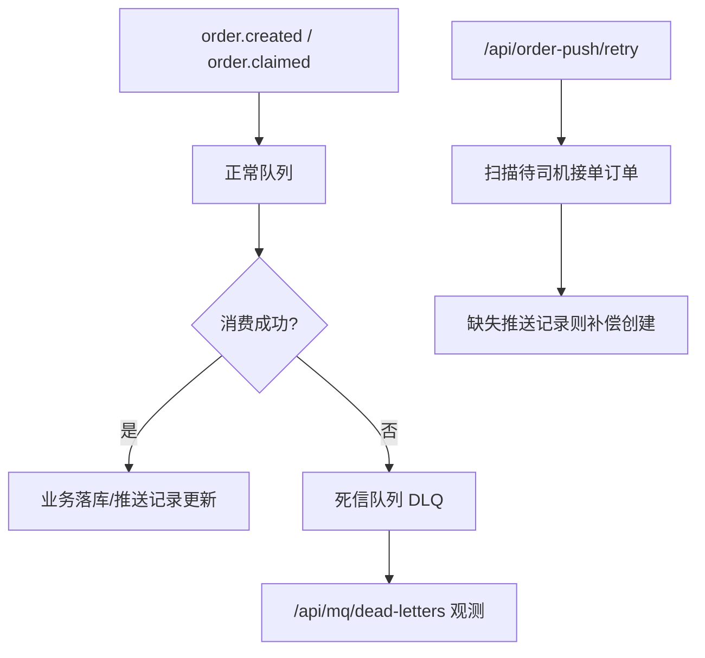

面试讲法：

> 对 MQ 异常消息配置了死信队列，并提供死信队列统计接口。对于订单推送这类可补偿业务，提供补偿接口扫描缺失推送记录的订单，重新按关注关系生成推送记录。

## 数据库设计摘要

- `purchaser_account`, `supplier_account`, `driver_account`：三类账号独立建表。
- `purchaser_profile`, `supplier_profile`, `driver_profile`：三类角色资料。
- `material`：基础物资字典。
- `supplier_material`：供应商供货物资、价格、库存、日产能。
- `purchase_order`：采购订单和抢购资源。
- `driver_follow`：司机和采购方关注关系。
- `order_push_record`：订单推送记录。
- `order_review`：订单履约评价。
- `transport_location_report`：司机上传到达节点历史，记录订单、司机、经纬度、备注和上传时间。

## 本地中间件

- MySQL：存储账号、资料、物资、订单、推送和评价。
- Redis：Token、Cache Aside、Lua 抢购、GEO、BitMap、ZSet。
- RabbitMQ：订单创建、抢购成功异步消息。
- Nacos：服务注册发现。

## 面试讲解结构

1. 先讲业务背景：自然灾害下供应链物资协同，涉及采购方、供应商、司机。
2. 再讲架构：Spring Cloud Gateway + Nacos + auth-service + MySQL/Redis/RabbitMQ。
3. 登录模块：Redis Token 替代 JWT，支持服务端控制登录态。
4. 权限边界：网关透传登录用户，业务接口按采购方、供应商、司机做角色隔离。
5. 供应商目录：Cache Aside、缓存空值、TTL 随机化、延迟双删。
6. 高并发抢购：Redis Lua 原子扣减，MQ 削峰，Redisson 锁兜底，避免超卖和重复抢。
7. 高并发司机抢单：Redis Lua 预占运力名额，RabbitMQ 异步绑定司机，MySQL 状态机兜底。
8. 推拉结合：推送记录给关注关系司机，司机也可以主动拉取待分配运输订单池。
9. 智能调度推荐：按在线状态、发货地距离和司机评分给待接单订单推荐运力。
10. 运输追踪：起终点建模、司机上传节点、MySQL 历史、Redis GEO 最新位置。
11. Redis 扩展：ZSet 排行榜、GEO 附近供应商和最新位置、BitMap 司机出勤。
12. 可靠性：RabbitMQ 死信队列、异常观测、补偿接口。
13. 前端展示：三角色页面不同，能直观看到业务隔离和核心链路。

## 可以继续增强的点

- 增加抢购压测脚本。
